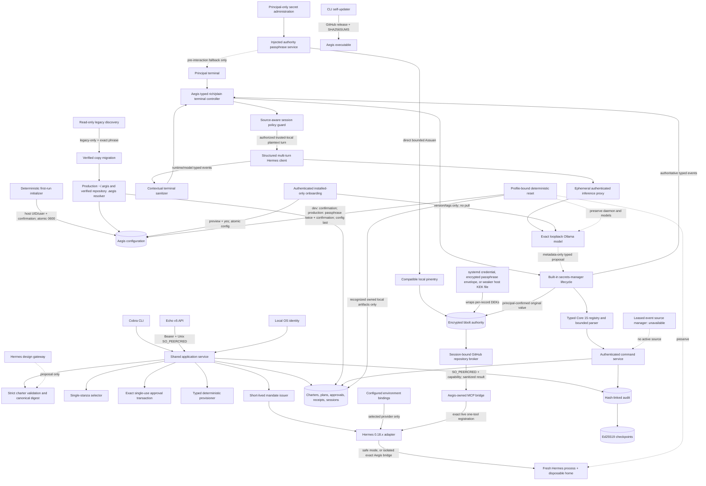

# Aegis MVP Architecture

The model proposes; it never authenticates, approves, or provisions. Design uses a disposable Hermes gateway process and returns an enveloped charter proposal. Aegis strictly decodes, validates, canonicalizes, digests, and persists it.

Provisioning currently supports only atomic creation of deterministic Aegis-owned mapping files. File modification, Hermes profile creation, MCP/plugin configuration, gateways, services, cron, and external network effects are explicitly classified and denied.

Operational launch resolves one stanza into one mandate, one credential binding, one set of Hermes toolset arguments, and one clean process/home. Selection evaluates verified subject, method, issuer, freshness, and trusted environment data; a requested stanza only filters already-authorized matches. Zero matches, overlapping policy, stale authentication, and multiple matches fail closed. Stored charter bytes and digests are revalidated before use, and mandate authority is compared exactly with the selected stanza before launch. `toolset_verification: launch_arguments` records argument-level verification rather than individual-tool runtime attestation.

The optional credential authority is a separate administrative data path. It stores independently encrypted immutable versions, exact agent/stanza/deployment/scope bindings, revocations, and metadata in one deployment-bound bbolt file. It validates schema, structural integrity, filesystem ownership/mode, and a KEK-authenticated sentinel before serving administration. The injected passphrase service is the single authority-passphrase edge for onboarding, secret administration, manager startup, and service opening. It selects an explicit validated absolute helper or conventional `pinentry`, executes it directly with an allowlisted desktop/session environment, bounds and validates the Assuan exchange, and returns process-local bytes only. Create uses two fresh interactions; unlock retries only envelope-authentication failure. Pre-`GETPIN` unavailability may use a real-terminal no-echo fallback, while cancellation and post-interaction failures fail closed. Systemd custody is a two-boundary resumable transaction: Aegis first records the exact external prerequisite, then—only after systemd delivers the KEK and the principal separately confirms—creates the database without copying or modifying the credential. Authority passphrase and administrative CLI intake remain outside the model and avoid argv; manager inline credential-create values may enter only the authenticated exact-local-model session described below. Inspection returns metadata only. Consistent backups use bbolt read transactions and do not include the KEK.

The optional Linux broker is an active model-visible authority-to-downstream edge for only `github.get_repository.v1`. It derives the exact binding and `github-api` destination from current Aegis state, applies the credential internally, and returns a bounded field allowlist. Its pathname socket authenticates a distinct runtime identity with `SO_PEERCRED`; a 256-bit capability is bound to the exact live session, mandate, charter, deployment, stanza, PID/start token, and expiry. Fresh 128-bit request IDs and bounded deadlines are deduplicated in a finite per-capability replay cache. Session cleanup revokes the capability and removes its file. For the exact `aegis` toolset, the adapter generates one disposable MCP server mapping and queries the live gateway, denying launch unless only `mcp__aegis__github_get_repository` is registered. Operational provider authentication continues through the configured environment-binding path. This remains application-level mediation, not host or network confinement. See `CREDENTIAL_BROKER.md`.

The API uses the same services as Cobra. Bearer authentication is transport-only; Linux Unix peer credentials create the Aegis subject. TCP TLS is optional transport encryption and does not map a principal identity.

Application services depend on a narrow audit-authority interface for append, inspection, and verification. The local MVP injects the file/checkpoint store; hardened deployment must place the same boundary behind a separately supervised process or OS account. Hermes processes receive neither that interface nor an audit credential. This service boundary does not by itself make the default same-account deployment externally tamper-proof.

Provisioning intent is persisted before approval consumption. Startup recovery finalizes interrupted receipts and removes only artifacts whose decoded content still matches the approved effect digest; mismatching files are retained and reported for manual intervention.

Self-update is an installation operation outside the application service and agent authority model. It accepts only published non-draft stable SemVer releases with exact metadata from the fixed Aegis GitHub repository, rejects API and untrusted or multi-hop download redirects and downgrades, follows only GitHub's bounded HTTPS release-asset redirect, bounds and validates the single-file archive, verifies its published SHA-256 checksum, and atomically replaces the current executable when its directory is writable. Local and remote Git tags are not updater discovery inputs.

Release publication is a separate deterministic operator transaction. Fresh publication performs signing preflight before its changelog-only commit and signed tag. If atomic push fails, recovery verifies the immutable tag object/signature/target, reproduces the exact release commit from its parent, re-verifies tagged source, compares local and remote objects explicitly, and publishes only missing refs without force. Hermes review remains advisory and has no publication authority.

Root dispatch inspects configuration before constructing operational services. Stable releases bind to the production `~/.argis` root while source-built `dev` binaries bind to `.aegis` beside the executable only after verifying that directory is the real Aegis module and Git worktree root. A copied development binary fails closed. Profile resolution derives separate config/state/checkpoint/authority/manager/runtime defaults without XDG scattering. Development attempts to resolve production paths are denied before service construction; each independently initialized authority receives a separate deployment identity. Help, version, update, and initialization do not require principal configuration. A genuinely absent interactive installation enters the deterministic initializer; legacy-only discovery reports migration/reset choices, and canonical-plus-legacy discovery denies. Linux migration uses a digest-bound exact plan, verified copy/fsync/publication, and only then descriptor-anchored source cleanup. Malformed, insecure, partial, and ambiguous artifacts remain distinct fail-closed states.

The manager orchestrator and terminal controller share one explicit lifecycle transaction. Composer submission is the only slash-dispatch origin: bounded command-position detection, exact typed parsing, alias canonicalization, lifecycle/prerequisite availability, shared application/store calls, typed presentation, metadata-only audit, and cleanup remain within Aegis. One registry supplies the Core 15 help, completion, dispatch, policy/audit operation, and result metadata. Unknown and malformed slash input is consumed before Hermes; untrusted model/runtime/tool/report/audit text is presentation-only. Core scans persist owner/stanza/scope-bound Aegis-native results and workflow records in the existing state store. The watch edge is intentionally inactive until a production leased event-source manager exists.

The manager orchestrator and terminal controller share one explicit lifecycle transaction. Low-ambiguity authenticated authority operations—including credential count, metadata list, exact-reference value retrieval, and complete inline create—bypass model negotiation and execute directly through typed manager operations. Deterministic Aegis code recognizes only clear intent, derives bounded validated metadata with protected defaults, and captures inline create values as session-scoped sensitive bytes. The authenticated imperative authorizes only the exact parsed operation. Create commits directly through the encrypted authority without contaminating the Hermes conversation; value retrieval checks exact reference and revocation state, decrypts through the authority, emits metadata-only audit, and renders terminal-escaped plaintext only in session presentation state that is purged on close. Terminal scrollback remains outside that purge boundary. Questions remain ordinary conversation. The controller is the ordinary presentation owner, renders security fields from the same typed principal/stanza/mandate/route values used by the manager, and accepts only closed origin-classified events. Model/runtime text crosses a contextual terminal sanitizer before width calculation; canonical message-only envelopes may release bounded monotonic message snapshots after their exact non-control prefix is recognized, while proposals and non-canonical responses remain buffered until complete validation. Protected intake temporarily owns terminal input but emits metadata-only state. The orchestrator: authenticate the principal; inspect authority/model/certification/Hermes readiness; verify exact certification and route identity; establish managed or external-local Ollama; load the pinned artifact; start an expiring authenticated proxy; launch a disposable safe-mode Hermes stdio gateway with no ambient extensions; execute closed typed proposals through shared credential services; and clean up in reverse order. Live certification uses the configured deadline for each Hermes turn and principal authority expiry for the complete transaction. Only schema-valid replies missing required conversational content enter a bounded three-execution loop with direct case-specific wording; other failures abort immediately by default. Explicit continue-on-error diagnostic execution may run later cases unless the context is cancelled or authority expires, but only a complete validated corpus is published. A timed-out or cancelled gateway is not reusable because stale events lack safe prompt correlation; only a complete validated corpus is published atomically. Terminal cancellation, expiry, runtime failure, EOF, and operator exit all transition through bounded idempotent cleanup. The executable boundary gives the first termination signal to that lifecycle and restores default handling so a second signal cannot be trapped. Hermetic fake-process and PTY tests exercise managed readiness/shutdown, multi-turn gateway behavior, proposal confirmation, protected-intake restoration, signal/EOF behavior, capability replay/expiry, model unload, receipt finalization, and disposable-state removal.

The terminal implementation deliberately retains the existing inline/native-scrollback architecture and adds no TUI dependency. Rich input explicitly enables bracketed-paste mode, keeps pasted multiline text in one bounded submission, normalizes CRLF, and restores paste mode with terminal state. On 2026-07-19 the implementation review evaluated Bubble Tea v2.0.8, Lip Gloss v2.0.5, Bubbles v2.1.1, Glamour v2.0.1, and Huh v2.0.3. Each used the MIT license, declared Go 1.25.0 or 1.25.8 (compatible with this project's Go 1.26.5 floor), and returned no module finding from the pinned `govulncheck v1.6.0` query. Their direct module files declared between 17 and 28 dependency lines. Aegis did not need fullscreen rendering, markdown interpretation, or generic forms for this operational inline slice; importing that stack would enlarge the dependency and terminal-mode surface without replacing Aegis's required sanitizer, protected-input handoff, deterministic approval, or manager lifecycle. The implementation therefore uses the already-pinned `golang.org/x/term` and `x/sys` primitives, a small typed controller, and the existing platform cancellation readers. Re-evaluate this decision before adding fullscreen or richer markdown behavior.

Candidate onboarding is separate deterministic application code, not a model turn. It lists a closed no-default registry, compares only local Ollama `/api/version` and `/api/tags` metadata at a loopback endpoint, previews managed versus external-local ownership, and applies an exact digest-bound external-local route only after principal authentication and explicit `[Y/n]` confirmation. Atomic validated configuration publication does not pull/copy an artifact and does not certify or activate it. Bare authority onboarding similarly collects and confirms the authority passphrase outside the model through pinentry-first protected requests (with a pre-interaction no-echo terminal fallback), encrypts the random KEK under an Argon2id-derived wrapping key with XChaCha20-Poly1305, and verifies the authority before continuing. Authority passphrases and KEKs are never model-visible; credential values supplied in an explicitly trusted-local manager conversation are the narrow exception described above.

Reset is also constructed outside the normal application service because it must safely remediate absent, partial, malformed, canonical, or exact legacy configuration. Reset is restricted to the invoking executable's exact profile layout; development requires only the final default-deny confirmation, while production with credential records or local encrypted KEK material authenticates the existing authority passphrase both before confirmation and again immediately before apply. It derives deletion authority only from recognized artifacts, exact-principal configuration, ownership/schema evidence, and a closed inventory. Legacy children under unsafe external XDG parents use device/inode-verified descriptor-relative operations and may be retained empty; the parent is untouched. Unknown content or changed identity denies. External/systemd custody, normal Hermes profiles, executable/source, operator Ollama state, and all downloaded models remain outside reset authority.
