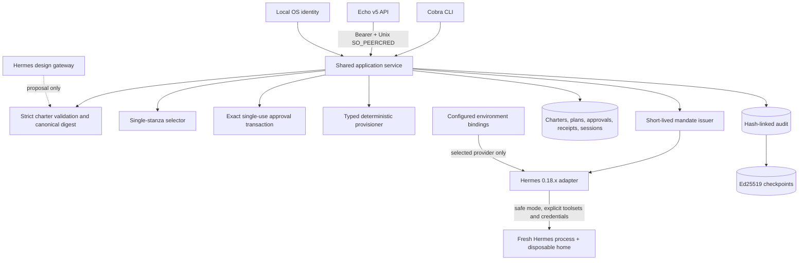

# Aegis MVP Architecture

The model proposes; it never authenticates, approves, or provisions. Design uses a disposable Hermes gateway process and returns an enveloped charter proposal. Aegis strictly decodes, validates, canonicalizes, digests, and persists it.

Provisioning currently supports only atomic creation of deterministic Aegis-owned mapping files. File modification, Hermes profile creation, MCP/plugin configuration, gateways, services, cron, and external network effects are explicitly classified and denied.

Operational launch resolves one stanza into one mandate, one credential binding, one set of Hermes toolset arguments, and one clean process/home. `toolset_verification: launch_arguments` records argument-level verification rather than individual-tool runtime attestation.

The API uses the same services as Cobra. Bearer authentication is transport-only; Linux Unix peer credentials create the Aegis subject. TCP TLS is optional transport encryption and does not map a principal identity.

Application services depend on a narrow audit-authority interface for append, inspection, and verification. The local MVP injects the file/checkpoint store; hardened deployment must place the same boundary behind a separately supervised process or OS account. Hermes processes receive neither that interface nor an audit credential. This service boundary does not by itself make the default same-account deployment externally tamper-proof.

Provisioning intent is persisted before approval consumption. Startup recovery finalizes interrupted receipts and removes only artifacts whose decoded content still matches the approved effect digest; mismatching files are retained and reported for manual intervention.
