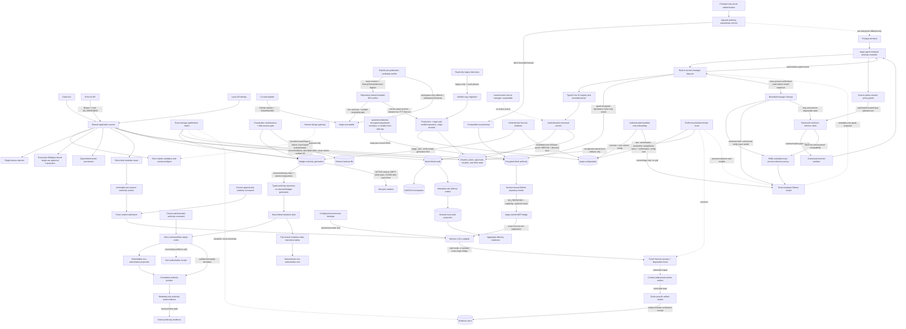

# Aegis MVP Architecture

```mermaid
flowchart TB
  CLI[Cobra CLI] --> Service[Shared application service]
  API[Echo v5 API] -->|Bearer + Unix SO_PEERCRED| Service
  OS[Local OS identity] --> Service
  Service --> Validator[Strict charter validation and canonical digest]
  Service --> Selector[Single-stanza selector]
  Service --> Approval[Exact plan-ID/digest-bound single-use approval transaction]
  Service --> Provisioner[Typed deterministic provisioner]
  Service --> Mandate[Short-lived mandate issuer]
  Mandate --> Context[Immutable per-session authority context]
  AuthorityRepo[Typed authority repository on selected Badger generation] --> Facts[Hash-linked transition facts]
  Command[Closed authenticated authority command] --> CanonicalReplay[Strict command/fact replay codec]
  Facts --> CanonicalReplay
  CanonicalReplay --> AuthorityProjection[Rebuildable non-authoritative projection]
  CanonicalReplay -. processing evidence only .-> AuthorityReceipt[Non-authoritative receipt]
  CanonicalReplay -->|verified immutable boundary| CommittedPosition[Committed authority position]
  AuthorityProjection --> CommittedPosition
  CommittedPosition --> AuthorityAudit[Metadata-only authority audit evidence]
  AuthorityAudit -->|exact-position gate| AuthorityReadiness[Grant-producing readiness]
  Facts --> Replay[Fail-closed complete-chain repository replay]
  Replay --> Root[Deterministic non-authoritative root]
  Revocation[Current append-only authority revocation] --> Admission[Fresh runtime admission]
  Context --> Admission
  Admission --> Adapter[Hermes 0.18.x adapter]
  Adapter -->|safe mode, or isolated exact Aegis bridge| Hermes[Fresh Hermes process + disposable home]
  Hermes -. untrusted output .-> RuntimeArtifact[Content-addressed runtime artifact]
  RuntimeArtifact -->|fresh blob read| Verifier[Claim-specific artifact verifier]
  Verifier -->|replay-resistant verification receipt| Evidence[(Evidence store)]
  Service --> State[(Charters, plans, approvals, receipts, and other state)]
  StorageContract[Exact storage qualification matrix] --> AuthorityPersistence
  StorageContract --> Authority
  StorageContract -. classifies; never unions .-> State
  StorageContract -. classifies; never promotes .-> Evidence
  Service --> AuthorityPersistence[(Badger authority generation)]
  AuthorityPersistence -->|versioned binary keys + atomic transactions| AuthorityRepo
  AuthorityPersistence -->|ACTIVE selects; DIRTY while open; CLEAN after sync/close| AuthorityMarkers[Lifecycle markers]
  Maintenance[Cooperative maintenance + disk-reserve gate] --> AuthorityPersistence
  Maintenance -->|bounded export/logical import; exact typed activate/native recover/rollback; descriptor-verified GC| Backup[(External backup file)]
  Service --> Audit[(Hash-linked audit)]
  Audit --> Checkpoint[(Ed25519 checkpoints)]
  Audit --> Outbox[(Metadata-only delivery outbox)]
  Outbox --> Projection[(Derived local audit projection)]
  Projection --> Readiness[Aggregate delivery readiness]
  Design[Hermes design gateway] -. proposal only .-> Validator
  Credentials[Configured environment bindings] -->|selected provider only| Adapter
  SecretCLI[Principal-only secret administration] --> Passphrase[Injected authority passphrase service]
  Passphrase -->|direct bounded Assuan| Pinentry[Compatible local pinentry]
  Passphrase -. pre-interaction fallback only .-> Terminal
  Pinentry --> Authority[(Encrypted bbolt authority)]
  Custody[systemd credential, encrypted passphrase envelope, or weaker host KEK file] -->|wraps per-record DEKs| Authority
  Authority --> Broker[Session-bound GitHub repository broker]
  Broker -->|SO_PEERCRED + capability; sanitized result| Bridge[Aegis-owned MCP bridge]
  Bridge -->|exact live one-tool registration| Adapter
  Updater[CLI self-updater] -->|GitHub release + SHA256SUMS| Binary[Aegis executable]
  ReleaseVerifier[Repository-owned installed-MVI verifier] -->|four archives + verified SHA256SUMS| Binary
  ReleaseVerifier -->|extract native archive; isolated non-TTY first run| Layout
  CandidateVerifier[Explicit pre-publication candidate verifier] -->|exact revision + binary/Hermes/decision digests| ReleaseVerifier
  CandidateVerifier -->|workspace-only rollback + withdrawal rehearsal| Binary
  Init[Deterministic first-run initializer] -->|stage, sync, verify empty generation first| AuthorityPersistence
  Init -->|revalidate host UID/user; atomic 0600 link + directory sync| Config[(Aegis configuration)]
  Layout[Production ~/.argis and verified repository .aegis resolver] --> Config
  Layout --> State
  Legacy[Read-only legacy discovery] -->|legacy-only + exact phrase| Migration[Verified copy migration]
  Migration --> Layout
  Terminal[Principal terminal] --> TUI[Aegis typed rich/plain terminal controller]
  TUI --> Manager[Built-in secrets-manager lifecycle]
  Manager --> Registry[Typed Core 15 registry and bounded parser]
  Registry --> ManagerCommands[Authenticated command service]
  ManagerCommands --> State
  ManagerCommands --> Audit
  Watch[Leased event source manager: unavailable] -. no active source .-> ManagerCommands
  Manager -->|authoritative typed events| TUI
  ManagerGateway -->|runtime/model typed events| Sanitize[Contextual terminal sanitizer]
  Sanitize --> TUI
  TUI --> Ingress[Source-aware session policy guard]
  Ingress -->|authorized trusted-local plaintext turn| ManagerGateway[Structured multi-turn Hermes client]
  ManagerGateway -->|fixed non-secret parser compatibility| Proxy[Pidfd-custodied exact-process inference proxy]
  Proxy --> Ollama[Exact loopback Ollama model]
  Ollama -. metadata-only typed proposal .-> Manager
  Manager -->|typed encrypted operations; insert-only create| Authority
  Manager -->|close process-authorized route before model teardown| Cleanup[Bounded manager cleanup]
  Cleanup --> Proxy
  Cleanup -->|external mode: unload and verify exact model| Ollama
  Cleanup -->|stop and remove disposable state| ManagerGateway
  Onboarding[Authenticated installed-only onboarding] -->|preview + yes; atomic config| Config
  Onboarding -->|version/tags only; no pull| Ollama
  Reset[Profile-bound deterministic reset] -->|dev: confirmation; production: passphrase twice + confirmation; config last| Config
  Reset -->|recognized owned local artifacts only| State
  Reset -. preserve .-> Hermes
  Reset -. preserve daemon and models .-> Ollama
```

The model proposes; it never authenticates, approves, or provisions. Design uses a disposable Hermes gateway process with the empty `no_mcp` toolset, bounds requirements and accumulated proposal output to 1 MiB, and accepts exactly one enveloped charter proposal. Aegis separately bounds import, then strictly decodes, validates, canonicalizes, digests, and persists it.

Provisioning currently supports only atomic creation of deterministic Aegis-owned mapping files. File modification, Hermes profile creation, MCP/plugin configuration, gateways, services, cron, and external network effects are explicitly classified and denied.

Operational launch resolves one stanza into one mandate, one credential binding, one set of Hermes toolset arguments, and one clean process/home. Selection evaluates verified subject, method, issuer, freshness, and trusted environment data; a requested stanza only filters already-authorized matches. Zero matches, overlapping policy, stale authentication, and multiple matches fail closed. Stored charter bytes and digests are revalidated before use, and mandate authority is compared exactly with the selected stanza before launch. `toolset_verification: launch_arguments` records argument-level verification rather than individual-tool runtime attestation.

Canonical domain ownership is bounded rather than represented by one mutable lifecycle aggregate. `core` owns subject, stanza decision, effective authority, mandate, immutable per-session authority context, session, and provisioning artifact/receipt records. It defines internal typed repository contracts without a generic kind, update, or replacement operation. The generation-managed Badger store implements them through one versioned binary key registry for metadata, mandates, contexts, the session-uniqueness index, transition facts and roots, canonical commands and facts, receipts, current projections, and derived outbox entries. Length-delimited identifiers keep prefixes isolated; strict decode rejects unknown versions/families, malformed lengths, invalid identifiers, zero sequences, and trailing bytes. Context plus session index creation and legacy fact plus root replacement are each conflict-detecting transactions. The command boundary atomically writes one accepted command, its controller-authored fact, durable receipt, current projection, and outbox entry; any collision or validation failure rolls the entire transaction back. Reads reject key/value identity, canonical replay, receipt linkage, projection, or outbox mismatches.

The adjacent canonical authority codec makes mutation intent and deterministic reconstruction explicit. Its closed activate/revoke/expire commands bind immutable command identity, mandate/context target, expected sequence and previous digest, authenticated actor, issuance/half-open expiry window, reason, and canonical digest. Accepted commands correspond one-to-one with immutable controller-authored facts. Portable replay strictly decodes versioned records and verifies command/fact identity, ordering, chain preconditions, context binding, legal transitions, time bounds, uniqueness, and digests before deriving a projection. Exact retries, including retries after the original command window, return the existing replay-verified receipt without appending another fact or outbox entry; reuse of a command ID with a different digest denies. Current-projection and admission reads replay canonical history and compare it with stored derived state inside one Badger read transaction. Only that replay-verified path derives a committed-authority position binding context ID, sequence, fact digest, and projection digest. Canonical authority audit delivery consumes verified outbox entries in strict sequence and creates deterministic metadata-only evidence for each exact position; exact retries add nothing, while malformed, gapped, reordered, or substituted state fails closed. The grant-producing readiness read evaluates ordinary admission and requires audit evidence to equal the current committed position in the same Badger snapshot, otherwise it denies with `audit_delivery_lagging`. Receipts, projections, outbox entries, positions, and audit evidence remain non-authoritative. This processing boundary is internal and is not yet exposed as a CLI/API mutation workflow.

The Badger repository now contains the canonical command-processing, authority-audit delivery, and exact-position readiness primitives, but existing application service mandate, context, revocation, launch-admission, and reset workflows are not yet migrated to them; their persisted formats and runtime behavior remain unchanged. `execution` owns dispatch and runtime-turn state plus the narrow launch/admission contract. `evidence` owns content-addressed runtime artifacts and claim-specific verification receipts. The Hermes adapter receives only an immutable launch contract and fresh admission decision. Evidence, receipts, projections, outbox entries, committed positions, authority-audit evidence, and transition roots cannot select a stanza, issue a mandate, authorize execution, or declare domain success. See `specs/CANONICAL_DOMAINS.md`.

The exact post-Track-A storage envelope is specified in `specs/STORAGE.md` and enforced in executable architecture and qualification tests. Session authority uses Badger `v4.9.5`; credential custody uses bbolt `v1.5.0`; both are qualified only for Linux/amd64/ext4 with the documented single-Aegis-process and engine-specific durability settings. Release cross-builds for macOS and arm64 prove packaging, not persistence qualification. Canonical facts, rebuildable projections, operational metadata, blobs, runtime state, and credential custody have separate owners and failure semantics. A derived record, audit-delivery marker, lifecycle marker, runtime home, or partial write in another store cannot complete or reconstruct missing authority.

Authority lifecycle mutation is serialized across cooperating processes by a root-scoped no-follow mode-`0600` `flock` coordinator. An open store holds a shared lease for its complete lifetime; initialization and maintenance operations require an exclusive, context-cancellable lease. On qualified Linux, lifecycle markers, generation moves, failed-staging cleanup, and GC deletion are relative to no-follow directory descriptors rather than re-resolved mutation paths. Initialization and candidate-producing maintenance require bounded output space plus a fixed 256 MiB reserve. Export requires a closed clean identity-verified active generation and publishes a bounded deterministic representation atomically without replacement. Logical recovery verifies the backup, imports canonical records into a fresh inactive generation with new identity, omits stored authority projections, and rebuilds those projections transactionally from canonical command/fact replay. Native recovery instead selects an exact verified retained generation. Activation, rollback, and native recovery monotonically advance activation identity and return a typed outcome recording whether selection committed and whether the previous generation retired, including when later cleanup or sync reports an error. Garbage collection captures and revalidates device/inode identity and removes only verified non-active generations under an explicit retention count. The backup checksum provides integrity detection, not encryption, a signature, publisher authentication, or independent rollback protection.

The optional credential authority is a separate administrative data path. It stores independently encrypted immutable versions, exact agent/stanza/deployment/scope bindings, revocations, and metadata in one deployment-bound bbolt file. It validates schema, structural integrity, filesystem ownership/mode, and a KEK-authenticated sentinel before serving administration. The injected passphrase service is the single authority-passphrase edge for onboarding, secret administration, manager startup, and service opening. It selects an explicit validated absolute helper or conventional `pinentry`, executes it directly with an allowlisted desktop/session environment, bounds and validates the Assuan exchange, and returns process-local bytes only. Create uses two fresh interactions; unlock retries only envelope-authentication failure. Pre-`GETPIN` unavailability may use a real-terminal no-echo fallback, while cancellation and post-interaction failures fail closed. Systemd custody is a two-boundary resumable transaction: Aegis first records the exact external prerequisite, then—only after systemd delivers the KEK and the principal separately confirms—creates the database without copying or modifying the credential. Authority passphrase and administrative CLI intake remain outside the model and avoid argv; manager inline credential-create values may enter only the authenticated exact-local-model session described below. Inspection returns metadata only. Consistent backups use bbolt read transactions and do not include the KEK.

The optional Linux broker is an active model-visible authority-to-downstream edge for only `github.get_repository.v1`. It derives the exact binding and `github-api` destination from current Aegis state, applies the credential internally, and returns a bounded field allowlist. Its pathname socket authenticates a distinct runtime identity with `SO_PEERCRED`; a 256-bit capability is bound to the exact live session, mandate, charter, deployment, stanza, PID/start token, and expiry. Fresh 128-bit request IDs and bounded deadlines are deduplicated in a finite per-capability replay cache. Session cleanup revokes the capability and removes its file. For the exact `aegis` toolset, the adapter generates one disposable MCP server mapping and queries the live gateway, denying launch unless only `mcp__aegis__github_get_repository` is registered. Operational provider authentication continues through the configured environment-binding path. This remains application-level mediation, not host or network confinement. See `CREDENTIAL_BROKER.md`.

The API uses the same services as Cobra. Bearer authentication is transport-only; Linux Unix peer credentials create the Aegis subject. TCP TLS is optional transport encryption and does not map a principal identity.

Application services depend on a narrow audit-authority interface for append, inspection, verification, bounded delivery, delivery status, projection verification, and derived-state rebuild. The local MVP injects the file/checkpoint store. Each canonical event receives one ID/digest-bound outbox entry and is projected in canonical order; projection-first publication plus outbox reconciliation makes interrupted retries idempotent. Readiness is false unless the canonical chain and derived prefixes are verifiable and current. Rebuild verifies the canonical chain and replaces only the outbox/projection, never canonical events or checkpoints. Hardened deployment must place the authority boundary behind a separately supervised process or OS account. Hermes processes receive neither that interface nor an audit credential. This local projection is operational derived state, not an external sink, and does not make the default same-account deployment externally tamper-proof.

Provisioning-plan preview requires a freshly authenticated configured principal and the exact local environment. Approval request and decision revalidate the current canonical charter and exact immutable plan; the approval records the plan ID/digest, charter digest, runtime, version, and environment. Provisioning intent records that exact plan digest before approval consumption. Startup recovery finalizes interrupted receipts and removes only artifacts whose decoded content still matches the approved effect digest while the consumed approval retains the same complete authority binding. Missing/corrupt bindings and mismatching files are retained and reported for manual intervention.

Self-update is an installation operation outside the application service and agent authority model. It accepts only published non-draft stable SemVer releases with exact metadata from the fixed Aegis GitHub repository, rejects API and untrusted or multi-hop download redirects and downgrades, follows only GitHub's bounded HTTPS release-asset redirect, bounds and validates the single-file archive, verifies its published SHA-256 checksum, and atomically replaces the current executable when its directory is writable. Local and remote Git tags are not updater discovery inputs.

Release publication is a separate deterministic operator transaction. Fresh publication performs signing preflight before its changelog-only commit and signed tag. If atomic push fails, recovery verifies the immutable tag object/signature/target, reproduces the exact release commit from its parent, re-verifies tagged source, compares local and remote objects explicitly, and publishes only missing refs without force. Hermes review remains advisory and has no publication authority.

CI and tag-triggered publication share one repository-owned installed-MVI verifier. It cross-builds the declared Linux/macOS amd64/arm64 archives, creates and verifies `SHA256SUMS`, extracts the native archive, verifies its injected stable version, and executes bare non-TTY first run under an isolated repository-local proof home. The expected result is a structured uninitialized denial and no production-state creation; this packaging proof neither publishes a release nor authorizes interactive initialization.

The separately gated pre-publication candidate verifier requires an exact stable version, clean source revision, canonical real Hermes executable, empty repository-local workspace, and strict bounded operator-supplied decision. It invokes the packaging path once, digest-binds and reuses the one extracted native candidate, rehearses replacement/rollback and withdrawal only in that workspace, and emits canonical local evidence stating that publication and production installation were not mutated. This is integrity and rehearsal evidence, not operator authentication, publisher attestation, release authorization, or proof of remote withdrawal.

Root dispatch classifies initialization, exact legacy migration, reset, repair denial, utility execution, or normal startup before constructing operational services. Every path uses the same complete profile-owned layout. Stable executables outside a worktree bind to the production `~/.argis` root, while an executable inside the verified Aegis module/worktree root is classified as development and binds to `.aegis` beside itself regardless of a clean embedded checkout tag. A copied development binary fails closed. Profile resolution derives separate config/state/checkpoint/authority-persistence/credential-authority/manager/runtime defaults without XDG scattering, and a state-root override rederives dependent defaults unless explicitly overridden. Development attempts to resolve production paths or invoke production migration are denied before service construction; each independently initialized authority receives a separate deployment identity. Help, version, update, and initialization do not require principal configuration. A genuinely absent interactive installation enters the deterministic initializer. Before publication and again at apply time, one fail-closed classifier checks the legacy `mandates`, `authority-contexts`, `authority-revocations`, and `sessions` JSON surfaces: only absence or recursively proven secure emptiness permits creation of `persistence/authority-v1`. The initializer creates the mode-`0700` state root, stages and syncs a Badger generation, publishes it without replacement, verifies its embedded identity, and only then revalidates operator identity and links the mode-`0600` configuration without replacement. It syncs the configuration directory before success. An interruption before configuration publication is resumable only when the existing authority opens as the same valid empty initialization generation. Opening validates `ACTIVE` before replacing `CLEAN` with `DIRTY`; successful sync/close removes `DIRTY` and restores `CLEAN`. Legacy-only discovery reports migration/reset choices, and canonical-plus-legacy discovery denies. Linux migration uses a digest-bound exact plan, verified copy/fsync/publication, and only then descriptor-anchored source cleanup. Malformed, insecure, partial, and ambiguous artifacts remain distinct fail-closed states.

The manager orchestrator and terminal controller share one explicit lifecycle transaction. Composer submission is the only slash-dispatch origin: bounded command-position detection, exact typed parsing, alias canonicalization, lifecycle/prerequisite availability, shared application/store calls, typed presentation, metadata-only audit, and cleanup remain within Aegis. One registry supplies the Core 15 help, completion, dispatch, policy/audit operation, and result metadata. Unknown and malformed slash input is consumed before Hermes; untrusted model/runtime/tool/report/audit text is presentation-only. Core scans persist owner/stanza/scope-bound Aegis-native results and workflow records in the existing state store. The watch edge is intentionally inactive until a production leased event-source manager exists.

The manager orchestrator and terminal controller share one explicit lifecycle transaction. The manager's Linux inference route starts a shell child blocked on an inherited one-shot pipe, with the real empty `no_mcp` toolset and a fixed public parser-compatibility API-key string rather than an authority-bearing credential. Aegis acquires pidfd custody and the current host boot identity, durably binds that exact still-blocked process to the initially unbound proxy, and only then writes a fixed non-secret release marker; the shell closes the gate descriptor and replaces itself with Hermes. Missing authorization, custody failure, EOF, malformed input, or release-pipe failure kills and reaps the blocked process group and removes its disposable home. The proxy checks each accepted TCP connection against the custodied process's live socket descriptors and denies after process exit or host reboot. Pidfd signaling supplements process-group cleanup without claiming host or network confinement. Low-ambiguity authenticated authority operations—including credential count, metadata list/search, exact-reference value retrieval, and complete inline create—bypass model negotiation and execute directly through typed manager operations. The interactive boundary formats typed credential records into bounded responsive lists and labeled details before emitting authoritative presentation events; it does not change the JSON contract of non-interactive CLI commands. Deterministic Aegis code recognizes only clear intent, derives bounded validated metadata with protected defaults, and captures inline create values as session-scoped sensitive bytes. The authenticated imperative authorizes only the exact parsed operation. Create commits directly through the encrypted authority without contaminating the Hermes conversation; value retrieval checks exact reference and revocation state, decrypts through the authority, emits metadata-only audit, and renders terminal-escaped plaintext only in session presentation state that is purged on close. Terminal scrollback remains outside that purge boundary. Questions remain ordinary conversation. The controller is the ordinary presentation owner, renders security fields from the same typed principal/stanza/mandate/route values used by the manager, and accepts only closed origin-classified events. Model/runtime text crosses a contextual terminal sanitizer before width calculation; canonical message-only envelopes may release bounded monotonic message snapshots after their exact non-control prefix is recognized, while proposals and non-canonical responses remain buffered until complete validation. Protected intake temporarily owns terminal input but emits metadata-only state. The orchestrator: authenticate the principal; inspect authority/model/certification/Hermes readiness; verify exact certification and route identity; establish managed or external-local Ollama; load the pinned artifact; start the pidfd-custodied process-authorized proxy; launch a disposable safe-mode Hermes stdio gateway with no ambient extensions; execute closed typed proposals through shared credential services; and clean up in reverse order. Live certification uses the configured deadline for each Hermes turn and principal authority expiry for the complete transaction. Only schema-valid replies missing required conversational content enter a bounded three-execution loop with direct case-specific wording; other failures abort immediately by default. Explicit continue-on-error diagnostic execution may run later cases unless the context is cancelled or authority expires, but only a complete validated corpus is published. A timed-out or cancelled gateway is not reusable because stale events lack safe prompt correlation; only a complete validated corpus is published atomically. Terminal cancellation, expiry, runtime failure, EOF, and operator exit all transition through bounded idempotent cleanup. The executable boundary gives the first termination signal to that lifecycle and restores default handling so a second signal cannot be trapped. Hermetic fake-process and PTY tests exercise managed readiness/shutdown, multi-turn gateway behavior, proposal confirmation, protected-intake restoration, signal/EOF behavior, turn-gate replay/expiry, model unload, receipt finalization, and disposable-state removal.

The terminal implementation deliberately retains the existing inline/native-scrollback architecture and adds no TUI dependency. Rich input explicitly enables bracketed-paste mode, keeps pasted multiline text in one bounded submission, normalizes CRLF, and restores paste mode with terminal state. On 2026-07-19 the implementation review evaluated Bubble Tea v2.0.8, Lip Gloss v2.0.5, Bubbles v2.1.1, Glamour v2.0.1, and Huh v2.0.3. Each used the MIT license, declared Go 1.25.0 or 1.25.8 (compatible with this project's Go 1.26.5 floor), and returned no module finding from the pinned `govulncheck v1.6.0` query. Their direct module files declared between 17 and 28 dependency lines. Aegis did not need fullscreen rendering, markdown interpretation, or generic forms for this operational inline slice; importing that stack would enlarge the dependency and terminal-mode surface without replacing Aegis's required sanitizer, protected-input handoff, deterministic approval, or manager lifecycle. The implementation therefore uses the already-pinned `golang.org/x/term` and `x/sys` primitives, a small typed controller, and the existing platform cancellation readers. Re-evaluate this decision before adding fullscreen or richer markdown behavior.

Candidate onboarding is separate deterministic application code, not a model turn. It lists a closed no-default registry, compares only local Ollama `/api/version` and `/api/tags` metadata at a loopback endpoint, previews managed versus external-local ownership, and applies an exact digest-bound external-local route only after principal authentication and explicit `[Y/n]` confirmation. Atomic validated configuration publication does not pull/copy an artifact and does not certify or activate it. Bare authority onboarding similarly collects and confirms the authority passphrase outside the model through pinentry-first protected requests (with a pre-interaction no-echo terminal fallback), encrypts the random KEK under an Argon2id-derived wrapping key with XChaCha20-Poly1305, and verifies the authority before continuing. Authority passphrases and KEKs are never model-visible; credential values supplied in an explicitly trusted-local manager conversation are the narrow exception described above.

Reset is also constructed outside the normal application service because it must safely remediate absent, partial, malformed, canonical, or exact legacy configuration. Reset is restricted to the invoking executable's exact profile layout; development requires only the final default-deny confirmation, while production with credential records or local encrypted KEK material authenticates the existing authority passphrase both before confirmation and again immediately before apply. It derives deletion authority only from recognized artifacts, exact-principal configuration, ownership/schema evidence, and a closed inventory. Legacy children under unsafe external XDG parents use device/inode-verified descriptor-relative operations and may be retained empty; the parent is untouched. Unknown content or changed identity denies. External/systemd custody, normal Hermes profiles, executable/source, operator Ollama state, and all downloaded models remain outside reset authority.
