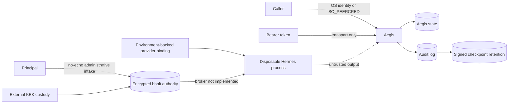

# Aegis MVP Threat Model

## Scope and assets

The MVP protects principal identity, canonical charters, stanza-specific authority, mandates, approval evidence, provider credentials, isolated Hermes state, provisioning artifacts, sessions, and audit history. It covers one configured principal, local Linux/CLI operation, and Hermes Agent `>=0.18.0,<0.19.0`.

## Actors

- Configured principal: trusted to approve exact authority.
- Authenticated non-principal subject: trusted only for matching stanzas.
- Hermes/model output: untrusted proposal and runtime output.
- Local attacker or compromised runtime: may supply prompts, request stanzas, alter writable files, or attempt process/credential access.
- Operator/deployment administrator: trusted to protect configuration, state, API token, TLS keys, and checkpoint retention.

## Trust boundaries

The CLI/API transport boundary authenticates callers outside the model. Charter validation and stanza selection form the authorization boundary. Approval separates proposal from deterministic provisioning. Each Hermes process/home is a stanza-state boundary. The host kernel, filesystem, and network remain outside Aegis confinement.

## Primary abuse cases and controls

| Abuse case | Control | Residual risk |
|---|---|---|
| Prompt claims principal identity | OS identity/SO_PEERCRED only | Compromised OS account remains authoritative |
| Stanza flag escalates authority | Selector evaluation; zero/multiple deny; no grant union | Bad charter selectors can authorize too broadly |
| Model provisions its proposal | Design has no provisioning service; strict Aegis import | Hermes process is not a host sandbox |
| Changed plan reuses approval | Complete typed plan digest is recomputed before use; atomic single use | Host admin can rewrite plan and approval state together |
| Team session receives principal key | Exact `provider:<provider>` scope and typed binding | Granted terminal/file tools can access ambient host resources |
| Ambient key reaches Hermes | Minimal environment and explicit injection | Proxy/CA environment is intentionally retained |
| Tool surface exceeds charter | Toolset allowlist and exact launch arguments | No individual-tool post-launch attestation in Hermes 0.18.x |
| Revoked/expired runtime continues | Supervisor, process start token, process-group termination | Crash recovery depends on persisted PID identity and OS state |
| Provisioning escapes state or crashes | Typed effects, containment, symlink rejection, atomic create, durable intent recovery | Same-account filesystem races are not a separate-user sandbox; mismatching recovery artifacts require manual review |
| Audit is rewritten | Narrow audit-authority boundary, hash chain, signed retained checkpoints | Default in-process authority and locally retained checkpoints can be replaced together |
| API token grants principal | Unix peer identity required | TCP principal identity is unavailable without a future mapper |
| Self-update installs a corrupted archive | Fixed repository URLs, stable SemVer tags, bounded archive parsing, release checksum verification, atomic replacement | GitHub release metadata and checksum delivery are one trust domain; no independent signature/transparency verification |
| Database theft exposes stored values | Fresh per-version DEK/nonces, XChaCha20-Poly1305, separately wrapped DEKs, KEK outside database | Metadata is sensitive; host-file KEK plus database theft defeats separation; root on an active host can inspect plaintext |
| Ciphertext/version/context is swapped | Canonical AAD binds store, record, version, kind, KEK, algorithm, format, and purpose; startup key check | No TPM monotonic anti-rollback protection; whole-host backup rollback needs external detection |
| Wrong stanza or destination resolves a secret | Exact agent + stanza + deployment + scope key and destination allowlist; missing/duplicate/revoked deny | Runtime broker and session capability enforcement are not implemented yet, so stored values are not exposed to Hermes |
| Secret leaks through administration | No argv value, confirmed no-echo intake or protected stdin, metadata-only output/audit, bounded buffers and best-effort overwrite | Go/runtime/OS may retain memory copies; protected-pipe hygiene is operator responsibility |

## Non-goals

The MVP does not provide host sandboxing, network confinement, multi-tenant isolation, formal information-flow tracking, hardware attestation, multi-party approval, externally anchored transparency, guaranteed plaintext zeroization/physical erasure, a completed credential broker or projection system, or protection from a fully compromised kernel/operator account.

## Deployment requirements

Protect Aegis state with mode 0700, keep API tokens/TLS keys outside source control, use Unix sockets for principal operations, place the audit-authority interface behind a separately supervised process/account, retain audit checkpoints on a separately protected boundary, supervise Aegis externally, and review any stanza granting `terminal` or `file` as broad host-facing authority. Keep the authority database on a local filesystem, keep KEK/recovery material out of its backup set, prefer encrypted systemd credential custody over host-file mode, disable core dumps, and encrypt ciphertext backups to offline recovery recipients before they leave the host.
