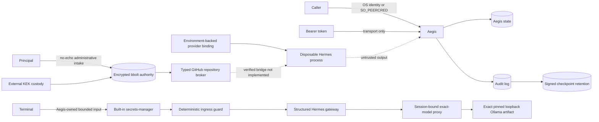

# Aegis MVP Threat Model

## Scope and assets

The MVP protects principal identity, canonical charters, stanza-specific authority, mandates, approval evidence, provider credentials, isolated Hermes state, provisioning artifacts, sessions, and audit history. It covers one configured principal, local Linux/CLI operation, and Hermes Agent `>=0.18.0,<0.19.0`.

## Actors

- Configured principal: trusted to approve exact authority.
- Authenticated non-principal subject: trusted only for matching stanzas.
- Hermes/model output: untrusted proposal and runtime output.
- Local attacker or compromised runtime: may supply prompts, request stanzas, alter writable files, or attempt process/credential access.
- Operator/deployment administrator: trusted to protect configuration, state, API token, TLS keys, and checkpoint retention.

## Trust boundaries

The CLI/API transport boundary authenticates callers outside the model. Charter validation and stanza selection form the authorization boundary. Approval separates proposal from deterministic provisioning. Each Hermes process/home is a stanza-state boundary. The host kernel, filesystem, and network remain outside Aegis confinement.

## Primary abuse cases and controls

| Abuse case | Control | Residual risk |
|---|---|---|
| Prompt claims principal identity | OS identity/SO_PEERCRED only | Compromised OS account remains authoritative |
| Stanza flag, profile, display name, or prompt escalates authority | Only verified subject/method/issuer/environment selectors authorize; a request only narrows; zero/multiple deny; no grant union | A legitimately trusted issuer or administrator can still configure an overly broad exact selector |
| Malformed, overlapping, disabled, or stale stanza policy is used | Strict required-field validation, overlap rejection, stored canonical digest verification, mandate-to-stanza equality, and runtime zero/multiple denial | Same-account state replacement remains possible without a stronger deployment boundary |
| Model provisions its proposal | Design has no provisioning service; strict Aegis import | Hermes process is not a host sandbox |
| Changed plan reuses approval | Complete typed plan digest is recomputed before use; atomic single use | Host admin can rewrite plan and approval state together |
| Team session receives principal key | Exact `provider:<provider>` scope and typed binding | Granted terminal/file tools can access ambient host resources |
| Ambient key reaches Hermes | Minimal environment and explicit injection | Proxy/CA environment is intentionally retained |
| Tool surface exceeds charter | Toolset allowlist and exact launch arguments | No individual-tool post-launch attestation in Hermes 0.18.x |
| Revoked/expired runtime continues | Supervisor, process start token, process-group termination | Crash recovery depends on persisted PID identity and OS state |
| Provisioning escapes state or crashes | Typed effects, containment, symlink rejection, atomic create, durable intent recovery | Same-account filesystem races are not a separate-user sandbox; mismatching recovery artifacts require manual review |
| Audit is rewritten | Narrow audit-authority boundary, hash chain, signed retained checkpoints | Default in-process authority and locally retained checkpoints can be replaced together |
| API token grants principal | Unix peer identity required | TCP principal identity is unavailable without a future mapper |
| Self-update installs a corrupted or unpublished archive | Fixed repository identity, published stable SemVer metadata, no redirects/downgrades, bounded archive parsing, release checksum verification, atomic replacement; Git tags alone are ignored | GitHub release metadata and checksum delivery are one trust domain; no independent signature/transparency verification |
| Interrupted release is resumed from a moved or forged tag | Existing annotated tag signature, exact annotation/object/peeled commit, reproducible changelog-only commit, local-main and remote-main relationship, and tagged-source verification; no force push or tag recreation | Git signing trust and operator repository access remain release-authority dependencies; ambiguous states require manual review |
| First run guesses identity or overwrites unsafe configuration | Host-native current-user plus UID lookup, exact preview, literal confirmation, no-replace atomic mode-0600 publication, and distinct absent/malformed/insecure/partial/ambiguous states | The authenticated local account, root, or kernel can still authorize or replace same-account configuration |
| Database theft exposes stored values | Fresh per-version DEK/nonces, XChaCha20-Poly1305, separately wrapped DEKs, KEK outside database | Metadata is sensitive; host-file KEK plus database theft defeats separation; root on an active host can inspect plaintext |
| Ciphertext/version/context is swapped | Canonical AAD binds store, record, version, kind, KEK, algorithm, format, and purpose; startup key check | No TPM monotonic anti-rollback protection; whole-host backup rollback needs external detection |
| Wrong stanza or destination resolves a secret | Broker requires exact peer + session capability + active session/mandate + charter + agent + stanza + local deployment + `github/read` scope + `github-api` destination + active binding/version on every use | No host/network confinement; a compromised authorized runtime may misuse its permitted read action |
| Prompt turns the broker into secret retrieval or SSRF | One strict `github.get_repository.v1` schema; caller cannot select URL, header, scope, record, version, deployment, stanza, or destination; redirects/proxy environment disabled; sanitized response allowlist | Configured downstream and DNS remain operator/network trust; Hermes bridge registration is not implemented |
| Capability or request is replayed by another local process | 256-bit short-lived capability digest plus exact SO_PEERCRED UID/GID and runtime PID/start-token ancestry; fresh bounded request IDs/deadlines reject duplicate or stale actions; termination/failure/expiry removes capability material | Same-host root/kernel can inspect process memory/files; production needs distinct service/runtime identities |
| Secret leaks through administration | No argv value, confirmed no-echo intake or protected stdin, metadata-only output/audit, bounded buffers and best-effort overwrite | Go/runtime/OS may retain memory copies; protected-pipe hygiene is operator responsibility |
| Credential is pasted into manager chat | Aegis owns terminal input; bounded deterministic scanning blocks before gateway/proxy and records no content; intentional create/rotate values use confirmed no-echo intake outside the model path | False negatives and Go/runtime memory copies remain possible |
| Hermes changes model or a same-host process calls the inference proxy | Expiring bearer capability consumed once per armed turn, exact route/model identity, active-session check, fixed path/method/content type, loopback-only target, complete response scan, and no redirects | Host root can inspect process memory; complete process/network confinement is not implemented |
| A same-UID process inspects the manager Hermes environment | Hermes 0.18.x receives its OpenAI-compatible proxy key through the provider environment because its gateway exposes no inherited-FD provider-key contract; the capability expires with principal authentication, is route-bound, and is consumed only while Aegis arms one turn | On hosts whose `/proc` policy permits same-UID environment inspection, another local process may steal the short-lived capability; production should use distinct runtime identity and restrictive procfs until Hermes supports inherited credential handles |

## Non-goals

The MVP does not provide host sandboxing, network confinement, multi-tenant isolation, formal information-flow tracking, hardware attestation, multi-party approval, externally anchored transparency, guaranteed plaintext zeroization/physical erasure, a model-visible verified Hermes broker bridge, a fleet projection system, or protection from a fully compromised kernel/operator account. The implemented broker supports only typed GitHub repository metadata.

## Deployment requirements

Protect Aegis state with mode 0700, keep API tokens/TLS keys outside source control, use Unix sockets for principal operations, place the audit-authority interface behind a separately supervised process/account, retain audit checkpoints on a separately protected boundary, supervise Aegis externally, and review any stanza granting `terminal` or `file` as broad host-facing authority. Keep the authority database on a local filesystem, keep KEK/recovery material out of its backup set, prefer encrypted systemd credential custody over host-file mode, disable core dumps, and encrypt ciphertext backups to offline recovery recipients before they leave the host.
