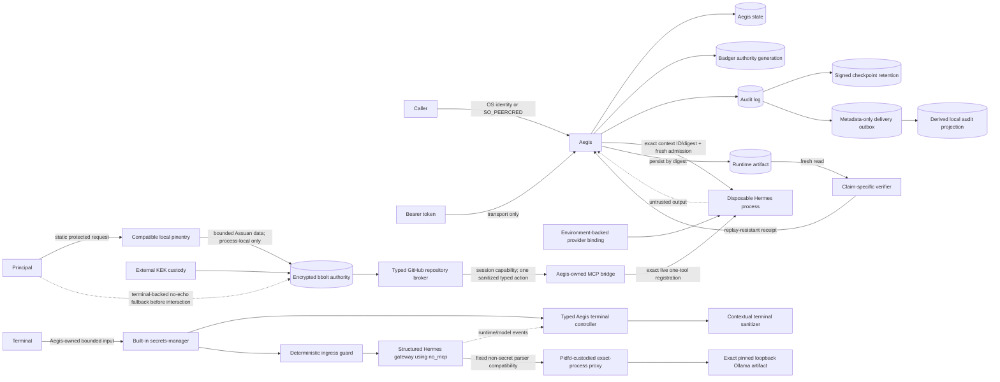

# Aegis MVP Threat Model

## Scope and assets

The MVP protects principal identity, canonical charters, stanza-specific authority, mandates, approval evidence, provider credentials, isolated Hermes state, provisioning artifacts, sessions, and audit history. It covers one configured principal, local Linux/CLI operation, and Hermes Agent `>=0.18.0,<0.19.0`.

## Actors

- Configured principal: trusted to approve exact authority.
- Authenticated non-principal subject: trusted only for matching stanzas.
- Hermes/model output: untrusted proposal and runtime output.
- Local attacker or compromised runtime: may supply prompts, request stanzas, alter writable files, or attempt process/credential access.
- Operator/deployment administrator: trusted to protect configuration, state, API token, TLS keys, and checkpoint retention.

## Trust boundaries

```mermaid
flowchart LR
  Caller -->|OS identity or SO_PEERCRED| Aegis
  Token[Bearer token] -->|transport only| Aegis
  Aegis --> Store[(Aegis state)]
  Aegis --> AuthorityState[(Badger authority generation)]
  Env[Environment-backed provider binding] --> Hermes[Disposable Hermes process]
  Principal -->|static protected request| Pinentry[Compatible local pinentry]
  Pinentry -->|bounded Assuan data; process-local only| Authority[(Encrypted bbolt authority)]
  Principal -. terminal-backed no-echo fallback before interaction .-> Authority
  KEK[External KEK custody] --> Authority
  Authority --> Broker[Typed GitHub repository broker]
  Broker -->|session capability; one sanitized typed action| Bridge[Aegis-owned MCP bridge]
  Bridge -->|exact live one-tool registration| Hermes
  Aegis --> Audit[(Audit log)]
  Audit --> Checkpoint[(Signed checkpoint retention)]
  Audit --> Outbox[(Metadata-only delivery outbox)]
  Outbox --> Projection[(Derived local audit projection)]
  Hermes -. untrusted output .-> Aegis
  Aegis -->|exact context ID/digest + fresh admission| Hermes
  Aegis -->|persist by digest| Artifact[(Runtime artifact)]
  Artifact -->|fresh read| Verifier[Claim-specific verifier]
  Verifier -->|replay-resistant receipt| Aegis
  Terminal -->|Aegis-owned bounded input| Manager[Built-in secrets-manager]
  Manager --> TUI[Typed Aegis terminal controller]
  Gateway -. runtime/model events .-> TUI
  TUI --> Sanitizer[Contextual terminal sanitizer]
  Manager --> Guard[Deterministic ingress guard]
  Guard --> Gateway[Structured Hermes gateway using no_mcp]
  Gateway -->|fixed non-secret parser compatibility| Proxy[Pidfd-custodied exact-process proxy]
  Proxy --> Ollama[Exact pinned loopback Ollama artifact]
```

The CLI/API transport boundary authenticates callers outside the model. Charter validation and stanza selection form the authorization boundary. Approval separates proposal from deterministic provisioning. Each Hermes process/home is a stanza-state boundary. The host kernel, filesystem, and network remain outside Aegis confinement.

## Primary abuse cases and controls

| Abuse case | Control | Residual risk |
|---|---|---|
| Prompt claims principal identity | OS identity/SO_PEERCRED only | Compromised OS account remains authoritative |
| Stanza flag, profile, display name, or prompt escalates authority | Only verified subject/method/issuer/environment selectors authorize; a request only narrows; zero/multiple deny; no grant union | A legitimately trusted issuer or administrator can still configure an overly broad exact selector |
| Malformed, overlapping, disabled, or stale stanza policy is used | Strict required-field validation, overlap rejection, stored canonical digest verification, mandate-to-stanza equality, and runtime zero/multiple denial | Same-account state replacement remains possible without a stronger deployment boundary |
| Model provisions its proposal | Design has no provisioning service; strict Aegis import | Hermes process is not a host sandbox |
| Changed plan reuses approval | Complete typed plan digest is recomputed before use; atomic single use | Host admin can rewrite plan and approval state together |
| Team session receives principal key | Exact `provider:<provider>` scope and typed binding | Granted terminal/file tools can access ambient host resources |
| Ambient provider or proxy authority reaches Hermes | Minimal environment and explicit selected-provider injection outside the manager; the manager receives only a fixed non-secret parser-compatibility string | A deliberately selected provider credential remains present for design/operational launches that require it; the public manager compatibility string is readable but grants no authority |
| Tool surface exceeds charter | Toolset allowlist and exact launch arguments | No individual-tool post-launch attestation in Hermes 0.18.x |
| Revoked/expired runtime continues | Supervisor, process start token, process-group termination | Crash recovery depends on persisted PID identity and OS state |
| Runtime input, historical state, or model output widens authority or presents stale authority as current | One immutable per-session authority context is bound exactly to its canonical mandate, charter revision, runtime, and effective authority; each runtime effect requires a fresh authoritative admission decision for the exact context ID/digest; append-only revocation and half-open expiry deny stale use | Authority contexts persisted before a failed launch can remain as orphan evidence; they do not create a session or grant a running process authority, but transactional cleanup remains desirable |
| Runtime output or a stored filename is treated as verification | Runtime output is stored by content digest; a claim-specific verifier rereads the blob and emits a receipt bound to artifact, action, run, owner, authority context, expected digest, verifier, and policy version | The verifier currently runs in the same process and uses the same local store/account; this is component separation, not independent attestation or separately protected evidence custody |
| Provisioning escapes state or crashes | Typed effects, containment, symlink rejection, atomic create, durable intent recovery | Same-account filesystem races are not a separate-user sandbox; mismatching recovery artifacts require manual review |
| Audit is rewritten | Narrow audit-authority boundary, hash chain, signed retained checkpoints | Default in-process authority and locally retained checkpoints can be replaced together |
| Audit delivery is interrupted, reordered, duplicated, or its derived state is tampered with | ID/digest-bound durable outbox, canonical-prefix validation, projection-first idempotent reconciliation, bounded ordered delivery, fail-closed readiness, and canonical-chain-first projection verification/rebuild | Outbox and projection share the same local account/filesystem boundary as canonical audit; they are operational derived state, not independent retention or external anchoring |
| API token grants principal | Unix peer identity required | TCP principal identity is unavailable without a future mapper |
| Self-update installs a corrupted or unpublished archive | Fixed repository identity, published stable SemVer metadata, no API or untrusted download redirects, an allowlisted HTTPS GitHub release-asset redirect, no downgrades, bounded archive parsing, release checksum verification, atomic replacement; Git tags alone are ignored | GitHub release metadata and checksum delivery are one trust domain; no independent signature/transparency verification |
| Interrupted release is resumed from a moved or forged tag | Existing annotated tag signature, exact annotation/object/peeled commit, reproducible changelog-only commit, local-main and remote-main relationship, and tagged-source verification; no force push or tag recreation | Git signing trust and operator repository access remain release-authority dependencies; ambiguous states require manual review |
| Release packaging publishes the wrong platform binary, version, checksum, or a state-mutating first-run artifact | One CI/release verifier cross-builds the four declared targets, generates and verifies `SHA256SUMS`, extracts the native archive, checks the injected exact stable version, and requires bare non-TTY first run under an isolated home to deny without creating `.argis` | CI verifies one native executable at runtime; cross-compiled non-native archives are build/checksum evidence rather than execution on each target OS, and GitHub remains the publication trust domain |
| First run guesses identity, publishes split operational state, or overwrites unsafe configuration | One complete profile-owned layout before service construction; host-native current-user plus UID lookup and immediate pre-publication revalidation; exact preview; explicit `[Y/n]` confirmation; mode-0700 root/state; verified empty authority generation published first; no-replace atomic mode-0600 configuration link plus directory sync; and distinct absent/malformed/insecure/partial/ambiguous states. Interrupted initialization resumes only from a valid empty generation | Publication spans authority and configuration rather than one filesystem transaction; the authenticated local account, root, or kernel can still authorize or replace same-account state |
| Fresh authority initialization silently coexists with or imports legacy JSON authority | One shared plan/apply/open classifier covers `mandates`, `authority-contexts`, `authority-revocations`, and `sessions`; only absent or recursively proven operator-owned mode-0700 directory-only trees pass, while populated, unreadable, symlinked, wrong-type, wrong-owner, or wrong-mode paths deny | Securely empty legacy directories may remain as inert names; same-account or root mutation after a check remains a host-filesystem risk |
| Authority startup or repository access selects malformed, substituted, cross-family, or crash-unclean Badger state | Staged no-replace generation publication, synced embedded store/schema/codec identity, digest-bound `ACTIVE`, strict marker decoding, explicit `CLEAN`/`DIRTY` lifecycle, one versioned length-delimited binary key registry, strict key/value identity checks, complete transition replay/root verification, and atomic context/index and fact/root transactions | `DIRTY` is crash evidence, not automatic recovery or independent tamper proof; Badger transaction atomicity does not protect against replacement by the same account/root, and the store and markers share the same local filesystem boundary |
| Concurrent maintenance, corrupt restore data, ambiguous rollback, or garbage collection damages authority state | Shared open-store and exclusive maintenance `flock` leases; context cancellation; closed-clean marker and embedded-identity verification; bounded strict backup codec with ordered registered keys and SHA-256; fresh imported identities; exact activation/rollback targets; verified non-active-only collection; atomic no-replace publication | Locks coordinate cooperating Aegis processes only; backups are not encrypted or signed, same-account/root mutation remains possible, SHA-256 does not authenticate a publisher, and whole-host rollback needs external detection |
| An unqualified persistence combination or cross-store partial result is treated as authority | Exact fail-closed matrix for Badger `v4.9.5` session authority and bbolt `v1.5.0` credential custody on Linux/amd64/ext4; pinned modules; engine-import and canonical-schema ownership tests; derived-state and cross-store non-authority rules | Qualification covers only the documented single-Aegis-process combinations; cross-built macOS/arm64 artifacts are not persistence evidence, and same-account/root replacement remains outside the application boundary |
| Legacy defaults are stranded, silently merged, or deleted through a writable XDG parent | Literal `~/.argis` typed resolver; artifact-derived legacy-only detection; canonical/legacy ambiguity denial; authenticated digest-bound migration; device/inode-verified descriptor-relative cleanup | Automatic migration/reset cleanup is Linux-only; interrupted post-publication cleanup can leave canonical plus legacy artifacts requiring exact manual inspection |
| Database or local encrypted-KEK-file theft exposes stored values | Fresh per-version DEK/nonces, XChaCha20-Poly1305, separately wrapped DEKs, KEK outside database; bare onboarding wraps the random KEK with an Argon2id-derived key and XChaCha20-Poly1305 | Metadata is sensitive; an offline passphrase attack remains possible; plaintext host-file KEK plus database theft defeats separation; root, the kernel, a compromised account/terminal, or an active process can capture plaintext |
| Authority passphrase is exposed through terminal/model/logs or a malicious helper response | Static Aegis-owned pinentry chrome, direct executable selection, bounded Assuan pipes, percent decoding, minimal environment, metadata-safe errors, no secret argv/config/audit/TUI state, fresh create/confirm requests, and no-echo terminal fallback only before interaction | A compromised account, desktop session, selected pinentry executable, root/kernel, or process-memory reader can capture bytes; pinentry provides no hardware custody, sandbox, keyring, cache, or recovery |
| Ciphertext/version/context is swapped | Canonical AAD binds store, record, version, kind, KEK, algorithm, format, and purpose; startup key check | No TPM monotonic anti-rollback protection; whole-host backup rollback needs external detection |
| Wrong stanza or destination resolves a secret | Broker requires exact peer + session capability + active session/mandate + charter + agent + stanza + local deployment + `github/read` scope + `github-api` destination + active binding/version on every use | No host/network confinement; a compromised authorized runtime may misuse its permitted read action |
| Prompt turns the broker into secret retrieval or SSRF | One strict `github.get_repository.v1` schema; caller cannot select URL, header, scope, record, version, deployment, stanza, or destination; redirects/proxy environment disabled; sanitized response allowlist; generated MCP bridge accepts only owner/repository and launch verifies its sole registered tool | Configured downstream and DNS remain operator/network trust; direct runtime network paths are not confined |
| Capability or request is replayed by another local process | 256-bit short-lived capability digest plus exact SO_PEERCRED UID/GID and runtime PID/start-token ancestry; fresh bounded request IDs/deadlines reject duplicate or stale actions; termination/failure/expiry removes capability material | Same-host root/kernel can inspect process memory/files; production needs distinct service/runtime identities |
| Secret leaks through administration | Authority passphrases use pinentry-first intake with no cross-surface downgrade after interaction; generic values use bounded no-echo single-line or bracketed multiline intake, independently confirmed framing, queued-input flush on mismatch, or explicit protected stdin; detected credential-bearing ordinary-composer submissions stop before Hermes; no argv value, metadata-only output/audit, bounded buffers and best-effort overwrite | Go/runtime/OS may retain memory copies; terminal scrollback and protected-pipe hygiene are operator responsibilities; terminals without bracketed-paste framing remain line-only |
| Credential metadata is listed/searched, or a credential is created or explicitly retrieved in the authenticated manager | Principal authentication, deterministic low-ambiguity intent/filter/exact-reference parsing, direct metadata list/search through the typed authority, fail-closed blocking of explicit credential-value syntax when create grammar does not map it, direct typed authority execution without a model round trip, atomic insert-only create with duplicate-reference conflict, separately confirmed rotation/replacement, encrypted durable storage, active/revoked checks, terminal-control escaping, metadata-only audit, and retained-session-content purge | Metadata itself can be sensitive; the authenticated terminal and active same-account processes can observe retrieved plaintext; terminal scrollback, swap, core dumps, kernel/root capture, filesystem snapshots, and forensic zeroization are outside Aegis's guarantee |
| Slash text in model/tool/sensor/report/audit output invokes local control | Dispatch accepts only composer-origin submissions; exact lowercase bounded parser consumes recognized, unknown, and malformed command-position input before Hermes; typed untrusted events cannot re-enter dispatch | Sanitized prose may still socially suggest that the operator type a command; the operator remains responsible for explicit submission |
| Core scan/watch output overstates host coverage | Scan modules, source health, gaps, omitted adapters, effective scope, and versions are typed; no-findings wording is scope-limited; `/watch` and host-expanding scans are unavailable without production sources | Aegis-native checks do not observe arbitrary host processes, network, files, persistence, packages, or endpoint threats |
| Model/runtime output rewrites the terminal or forges Aegis approval chrome | Closed origin-classified presentation events; explicit bracketed-paste enable/restore with one bounded, CRLF-normalized, fully scanned multiline submission; contextual CSI/OSC/DCS/APC/PM/SOS, control, bidi/invisible and malformed-UTF-8 sanitization before width/layout; bounded components; canonical message-only streaming releases monotonic sanitized snapshots while proposals remain buffered; authoritative trust/approval fields never come from model events | Ordinary sanitized prose can still attempt social deception; streamed prose is explicitly untrusted and may later be marked rejected if its completed envelope is invalid; the terminal and same-account process are not a sandbox |
| Hermes changes model or another local process calls the inference proxy | Fixed non-authoritative compatibility header, mandatory live pidfd custody of the exact Hermes process, accepted-connection ownership verification against that process's socket descriptors, exact route/model identity, active-session and one-use-per-turn gates, fixed path/method/content type, loopback-only target, complete response scan, and no redirects | Host root/kernel can manipulate or inspect process/network state; `/proc` availability is required; complete host/network confinement is not implemented |
| A certification turn stalls or emits events after cancellation | Configured per-turn deadlines, principal-expiry overall deadline, a bounded three-execution loop with direct case-specific wording only for missing required conversational content, default immediate abort on other failures, cancellation/expiry stop even in explicit continue-on-error diagnostic mode, permanently poisoned interrupted gateway client, reverse-order cleanup, and atomic all-cases-success-only certification publication | Slow local hardware or repeated incomplete conversational responses can still exhaust short principal authority and require an explicit retry; diagnostic continuation costs additional local resources; Hermes events do not carry prompt correlation IDs |
| A same-UID process inspects the manager Hermes environment or copies its API-key-shaped value | Hermes 0.18.x receives only a fixed public parser-compatibility string; proxy authority is instead bound to Aegis-retained Linux pidfd custody and the exact accepted TCP connection owned by that process | Copying the string grants no authority, but root/kernel or an attacker able to compromise the custodied process can still act through that process; pidfd and `/proc` connection verification are Linux-specific and fail closed elsewhere |
| Signal, EOF, or blocked intake leaves terminal/process/model state behind | Context-cancellable ordinary/protected intake, captured terminal-state restoration, one lifecycle state machine, reverse-order bounded idempotent cleanup, first-signal cancellation, and second-signal default termination | Forced second-signal or host kill can interrupt cleanup; managed runtime crash recovery remains bounded by retained Aegis metadata and operating-system process state |
| Onboarding silently selects, downloads, or mutates a model | Closed no-default registry, loopback installed-only Ollama discovery, immutable digest match, complete preview, explicit `[Y/n]` confirmation, configuration-digest recheck, strict validation, and atomic mode-0600 publication; certification and activation remain separate | Ollama metadata and the local operator remain trust dependencies; Aegis does not prove artifact provenance merely from a local digest |
| Development and release binaries collide or reset the wrong authority | Stable binaries outside a worktree select production `~/.argis`; executable placement inside the verified Aegis module/worktree root overrides an embedded clean tag and selects ignored repository-local `.aegis`; production-path denial; separate deployment identities; reset restricted to its exact profile layout | A deliberately modified binary can bypass application checks; profile separation and Git ignore are not a host sandbox |
| Reset follows a malicious path or erases external/operator state | Profile-bound target, host-native principal match, production double authentication with the existing 12+ byte authority passphrase when credential material is in scope, deliberate confirmation-only development reset, operator-home containment, repository rejection except for the exact development `.aegis` subtree, root/home rejection, no symlink following, owner/mode/link checks, closed artifact inventory, Aegis schema evidence, complete preview, explicit default-deny confirmation, immediate full-plan revalidation, descriptor-anchored device/inode-checked legacy deletion, and configuration-last ordering | Development intentionally trades passphrase reauthentication for rapid local reset; deletion is not one transaction across independent paths, and an interrupted reset may require exact inspection and recovery from a separate backup |

## Non-goals

The MVP does not provide host sandboxing, network confinement, multi-tenant isolation, formal information-flow tracking, hardware attestation, multi-party approval, externally anchored transparency, guaranteed plaintext zeroization/physical erasure, a generic credential bridge, a fleet projection system, or protection from a fully compromised kernel/operator account. The model-visible broker bridge supports only typed GitHub repository metadata.

## Deployment requirements

Protect production `~/.argis` and repository-local `.aegis` roots and their state with mode 0700, never copy authority material between profiles, keep API tokens/TLS keys outside source control, use Unix sockets for principal operations, place the audit-authority interface behind a separately supervised process/account, retain audit checkpoints on a separately protected boundary, supervise Aegis externally, and review any stanza granting `terminal` or `file` as broad host-facing authority. Use only an explicitly qualified storage combination; the current post-Track-A envelope is Linux/amd64/ext4 with the exact versions and settings in `specs/STORAGE.md`, not every platform with a release archive. Keep the authority database on a local filesystem, keep KEK/recovery material out of its backup set, use only a trusted pinentry executable/session for foreground passphrase custody, prefer encrypted systemd credential custody for headless services, disable core dumps as an operator/OS control (Aegis does not enforce this), and encrypt ciphertext backups to offline recovery recipients before they leave the host.
